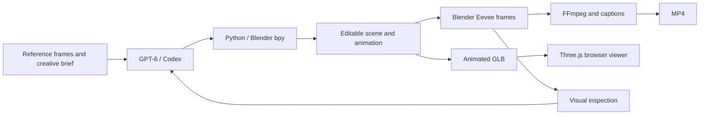

# gpt-blender

[简体中文](README.zh-CN.md)

A collection of editable 3D scenes and interactive browser demos created with GPT and Blender, including Niu Lai, Saber and a cycling pelican.

**A Chinese movie meme, rebuilt as an editable 3D scene.** A calf screams “Mama!”, his mother turns and answers “Niu Lai!”, and the camera pulls back to reveal both characters and a snake in the same scene.

GPT‑6 / Codex wrote and revised the Blender Python scripts. Blender generated the geometry and rendered the animation. You can watch the film, rotate the exported model in your browser, or edit the entire scene in Blender.


[Blender scene](output/niulai.blend) · [Animated GLB](web/assets/niulai.glb) · [GitHub Pages deployment](deploy/README.md)

## New demo: Apple Duo — unfold the surprise

A silver folding phone opens to reveal a continuous portrait across its inner display. Blender constructs the two hinges, machined enclosure, cameras, outer screen and buttons; the browser scrubs the exported object animations. This is a visual concept with invented dimensions.


```sh
npm run dev                       # Open http://127.0.0.1:8080/duo/
npm run duo:scene -- --preview     # Rebuild Blender, GLB and three inspection renders
npm run test:duo                   # Verify actual hinges, interactions and mobile layout
npm run duo:video                  # Render a 12-second 1080×1080 MP4
```

The viewer supports a looping reveal, a 0–180° slider, camera orbit, front/back views and PNG downloads. Reduced-motion users start with a still, open device. The Unsplash portrait is stored locally and packed into the model. All interaction runs locally after loading.

[Editable Blender scene](output/duo/duo.blend) · [Animated GLB](web/duo/assets/duo.glb) · [12-second film](output/duo/duo-reveal.mp4) · [Build script](src/build_duo.py). Frames 1–121 at 30 fps define closed-to-open motion; the browser arranges it into a 12-second round trip. The film captures that GLB in the browser studio and encodes it with FFmpeg. The browser also draws the outer lock-screen interface.

## New demo: Pelican cycling club

**Take the scenic route.** An ivory pelican in a coral scarf pedals a mint-green bicycle through a miniature coastal scene. Its long bill, throat pouch, layered feathers, webbed feet, spokes, fenders, chain and bell are actual geometry.


The demo follows the same **Blender Python → Eevee render inspection → animated GLB → Three.js** workflow. Analytic two-link legs follow opposite pedals through a seamless four-second loop. Feet and pedals remain level, the wheels turn at twice the crank's angular speed, and the head and scarf move gently. Browser lane markings pass beneath the bike at the tire's rolling speed.

```sh
npm run dev                          # Open http://127.0.0.1:8080/pelican/
npm run pelican:scene -- --preview   # Rebuild .blend, GLB and four inspection renders
npm run test:pelican
```

Drag to orbit, scroll to zoom, choose three cameras, adjust 0.5–2× speed, pause, auto-orbit, ring the bell or save a PNG. Space pauses; B rings the bell. Reduced-motion visitors start paused. All assets are local, and interaction makes no further network requests after loading; Web Audio synthesizes the bell on demand.

Sources: [build script](src/build_pelican.py), [editable Blender scene](output/pelican/pelican.blend), [animated GLB](web/pelican/assets/pelican.glb), [viewer](web/pelican/). This is an original procedural scene with no external models, image textures or recordings. The GLB contains baked object-transform animation; the editable scene retains individual parts, with static meshes batched by material and parent only for export.

Verification accepts the same `CHROME_BIN` and `PREVIEW_URL` variables as the other demos. It checks foot/pedal contact across the full cycle, the 2:1 gear ratio, frozen scenery and scarf while paused, actual playback speed, cameras and zoom, bell, PNG download, phone/tablet layouts, failed-model recovery and reduced motion. Reports go to `output/pelican/verification.json`; screenshots go to `renders/pelican/`.

## Saber digital figure

**[Open the Saber exhibit](https://askuy.github.io/niulai-site/saber/)** — a stylized, fully three-dimensional fan figure inspired by Saber from *Fate/stay night*. Orbit the blonde hair and braid, blue dress, silver armor, Excalibur and engraved display base.


The third sculpt studies [Good Smile's Saber ~Triumphant Excalibur~ product photographs](https://www.goodsmile.info/en/product/2780/) with a focus on likeness: a shorter lower face, fuller teal irises, angled eyelids, uneven swept hair layers, tapered closed hair tips and buried temple roots. Painted skin color, a higher cuirass neckline, asymmetric skirt lift and a wider stance refine the figure. A baked mouth expression follows the sword action and returns to calm at idle. [src/saber_portrait.py](src/saber_portrait.py) owns the face and hair; [src/saber_sculpt.py](src/saber_sculpt.py) owns the costume and sword.


Reference photos are not used as textures or published web assets. Visual review compares head proportions, eyes and hair direction in adjacent crops; different poses, expressions and lighting make a pixel-based identity percentage inappropriate. With the local reference and previous-render cache present, `node src/compare_saber.mjs` produces `.cache/saber-reference/likeness-comparison.jpg`. This remains a procedural fan sculpt, with visible differences in hair detail, expression and body pose from the finished reference figure.

The figure breathes, blinks, turns her head and moves her skirt. “抬剑致意” plays a salute; “唤醒圣剑” raises, charges and swings the sword before returning to idle. Both hands follow the grip through baked two-bone IK. Pause freezes the pose and effects; the viewer also offers close-up cameras, three lighting presets, white resin material and PNG capture.

The same **GPT‑6 / Codex → Blender Python → Eevee render inspection → revision → animated GLB → Three.js** workflow creates the model. Blender supplies the geometry, rig and eye shape keys; Three.js supplies the viewer, lighting and gold particles. This is a procedural fan-art study, with no official model files or motion capture.

```sh
npm run dev                          # Visit /saber/
npm run saber:scene -- --preview     # Rebuild the scene, GLB and eight inspection frames
npm run saber:scene -- --study face  # Render a portrait study without replacing the scene or GLB
npm run test:saber
```

Sources: [build script](src/build_saber.py), [editable Blender scene](output/saber/saber.blend), [animated GLB](web/saber/assets/saber.glb). The 24 fps, 384-frame timeline contains idle at 0–4 seconds, salute at 4–10 and the sword action at 10–16. The saved scene preserves individual parts; only the export representation merges meshes by material.

The GLB is approximately **8.4 MB uncompressed**, plus the shared Three.js and page files on first load. After loading, interaction does not trigger further requests. Hosting stays on free GitHub Pages, with no backend or AI API calls. Blender Python is only used offline. The viewer starts paused when the browser requests reduced motion.

## Run the interactive preview

The website is entirely static. Its model, audio and viewer libraries live in `web/`, with no AI API calls. Use **Node.js 22+** for local preview; visitors only need a browser with WebGL support. Hosting requires no backend runtime.

```sh
git clone git@github.com:askuy/niulai.git gpt-blender
cd gpt-blender
npm ci
npm run dev
```

The default address is **http://127.0.0.1:8080/**; use the address printed in the terminal if that port is occupied. Run `npm run dev -- -p 8767` to choose a port explicitly.

- Press the start button to play with the original dialogue.
- Drag to orbit the camera; scroll or pinch to zoom.
- Scrub the timeline, replay “Mama!”, or return to the director's camera.
- The preview interface is in Simplified Chinese; dialogue has English subtitles.

## GitHub Pages

The site is hosted at **https://askuy.github.io/niulai-site/**. Development sources stay in this private repository; the public `askuy/niulai-site` repository contains only the viewer, model and dialogue audio from `web/` and uses free GitHub Pages hosting.

Run `npm run publish:pages` to update the website using Git over SSH. No backend runtime is needed. See [deployment instructions](deploy/README.md) for details. The Python / Blender tools below are only used for offline asset and video generation.

## What GPT‑6 contributes to 3D work

This project illustrates how GPT‑6 can turn a visual reference and a creative brief into a controllable scene, then improve the result through rendered feedback.

| Strength illustrated here | Concrete result in this repository |
| --- | --- |
| **Breaking a reference into buildable parts** | The script separates horns, ears, eyes, brows, muzzle, lips, teeth and tongue, then combines them into recognizable characters. See `cow()` and `mouth_mesh()`. |
| **Planning geometry and space** | Two different body types, the snake, rocks, lights and a moving camera share one scene. Orbiting exposes side and rear views, so the geometry must work beyond the opening shot. |
| **Coordinating animation** | Facial shape keys, jaw motion, head turns and camera keyframes run on one timeline. A Python-derived audio amplitude envelope drives mouth opening; this is amplitude-based animation, not phoneme recognition. |
| **Improving a result through tools** | Render inspection led to fixes for horn seams, the connection between the mouth and face, a rock intersecting a hoof, and the camera's return path. |
| **Producing editable deliverables** | The result includes the generation script, `.blend` scene, animated `.glb`, rendered videos and a browser viewer. Proportions, timing, lighting and camera positions can be changed and regenerated. |

The practical advantage is the ability to **combine scene planning, code generation and visual iteration within one workflow**. Blender supplies the geometry operations and renderer; GPT‑6 supplies the scripted construction and revisions. The orbit demonstrates the resulting scene's structure. This is a project demonstration, not a controlled comparison with other models or evidence that these capabilities are exclusive to GPT‑6.

The work used multiple iterations. The exact API model snapshot was not separately logged, so this repository makes no single-prompt, speed or benchmark claims.

## How it works



**Three.js is used for the browser viewer.** Modeling, animation generation and the video render are performed in Blender. No Blender MCP server or 3D-generation API is required by these scripts.

The workflow was informed by [this OpenAI Developer Community discussion](https://community.openai.com/t/1395391/2), where a community member describes driving headless Blender through `bpy`. That discussion is community guidance, not an official confirmation of how OpenAI's release demo was produced.

## Rebuild the scene and videos

Requirements:

- **Blender 4.5 LTS**, with a graphics device/driver supported by Eevee. The included scene was created with Blender 4.5.13.
- **Python 3.10+**, **Node.js 22+**, and **FFmpeg** with H.264/AAC encoding.
- A font covering Chinese characters for regenerated captions, such as PingFang SC on macOS or Noto Sans CJK on Linux.

Install the small set of development dependencies:

```sh
npm ci
```

Build the editable scene, export the GLB, and inspect three rendered stills:

```sh
npm run scene -- --preview
```

The launcher finds `blender` on `PATH`, the standard macOS application path or `~/.local/opt/blender-4.5.13/Blender.app`. For another installation, set `BLENDER_BIN` to its executable:

```sh
BLENDER_BIN=/path/to/blender npm run scene -- --preview
```

Render all 336 frames and compose both videos:

```sh
npm run render
npm run video
```

You can also invoke Blender directly:

```sh
blender --background --python src/build_scene.py -- --render
python3 src/compose_video.py
```

The scene and videos use a fixed **24 fps** timeline. Full rendering produces 14 seconds of animation at 1080 × 1080. Composition adds a 3-second reference montage for the 17-second social video. Rendered frames are generated locally under `renders/` and excluded from Git.

The dialogue excerpt and amplitude envelope are already included. To regenerate them from the reference video:

```sh
npm run reference
```

## Verify the viewer

```sh
npm ci
npx playwright install chromium
npm test
npm run test:saber
```

The check starts its own local server on an available port and stops it afterward. It checks model loading, audio start/pause, timeline seeking, subtitles, actual camera movement, replay, director reset and mobile layout.

You can use an existing browser with `CHROME_BIN=/path/to/chrome npm test`. The check starts a temporary static server; use `PREVIEW_URL=https://askuy.github.io/niulai-site/ npm test` to check the deployed viewer. Screenshots are written to `renders/`; the local report is `output/verification.json`.

The Saber check uses the same environment variables. Give `PREVIEW_URL` the site root; it appends `saber/`. It checks exported jewel dimensions, blink shape keys, real hand and sword motion, frozen effects, return to idle, camera controls, materials, lighting, PNG download, mobile layout and extra network requests. Its report is `output/saber/verification.json`, with screenshots in `renders/saber/`.

## Files

| Path | Purpose |
| --- | --- |
| [`src/publish_pages.mjs`](src/publish_pages.mjs) | Publish viewer assets to the separate Pages repository |
| [`deploy/`](deploy/) | Static site deployment and verification guide |
| [`src/build_scene.py`](src/build_scene.py) | Procedural models, materials, facial shape keys and animation |
| [`src/build_saber.py`](src/build_saber.py) | Saber geometry, two-handed sword IK, rig and animated GLB export |
| [`src/saber_sculpt.py`](src/saber_sculpt.py) | Reference-led face, hair, costume and sword geometry |
| [`src/verify_saber.mjs`](src/verify_saber.mjs) | Saber viewer and animation checks |
| [`web/saber/`](web/saber/) | Saber exhibit and its model |
| [`src/prepare_reference.py`](src/prepare_reference.py) | Dialogue extraction and amplitude analysis |
| [`src/compose_video.py`](src/compose_video.py) | Video editing, original audio and bilingual captions |
| [`src/caption_frames.mjs`](src/caption_frames.mjs) | Transparent caption plates, rendered with Sharp |
| [`src/verify.mjs`](src/verify.mjs) | Browser interaction checks |
| [`web/`](web/) | Local viewer, vendored Three.js, audio and animated GLB |
| [`output/`](output/) | Finished MP4s, editable `.blend`, cover and storyboard |
| [`reference/`](reference/) | Source excerpt and reference frames |

## Credits and provenance

The meme and original dialogue come from **《牛来》 (Niu Lai)**. The reference is a third-party recording published by **猫眼侃世界**: [source video](https://newsa.html5.qq.com/v1/share-video?vid=93819400611114414). “Niu Lai” is the calf's name.

The original audio is excerpted and replayed; no voice cloning was used. Characters were built procedurally in a clay cartoon style from the reference frames, with no original film model files. Source media and original character rights remain with their respective owners. See [ASSET_CREDITS.md](ASSET_CREDITS.md) for clip timings and third-party software attribution.
