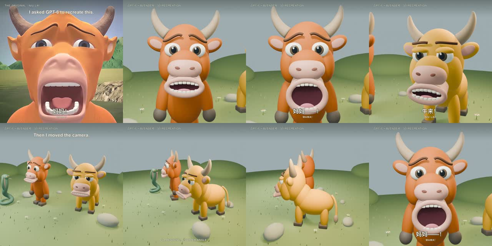
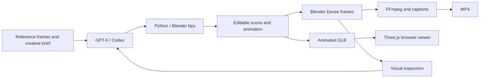

# Niu Lai — GPT‑6 × Blender

[简体中文](README.zh-CN.md)

**A Chinese movie meme, rebuilt as an editable 3D scene.** A calf screams “Mama!”, his mother turns and answers “Niu Lai!”, and the camera pulls back to reveal both characters and a snake in the same scene.

GPT‑6 / Codex wrote and revised the Blender Python scripts. Blender generated the geometry and rendered the animation. You can watch the film, rotate the exported model in your browser, or edit the entire scene in Blender.



[Blender scene](output/niulai.blend) · [Animated GLB](web/assets/niulai.glb) · [GitHub Pages deployment](deploy/README.md)

## Run the interactive preview

The website is entirely static. Its model, audio and viewer libraries live in `web/`, with no AI API calls. Use **Node.js 22+** for local preview; visitors only need a browser with WebGL support. Hosting requires no backend runtime.

```sh
git clone git@github.com:askuy/niulai.git
cd niulai
npm ci
npm run dev
```

The default address is **http://127.0.0.1:8080/**; use the address printed in the terminal if that port is occupied. Run `npm run dev -- -p 8767` to choose a port explicitly.

- Press the start button to play with the original dialogue.
- Drag to orbit the camera; scroll or pinch to zoom.
- Scrub the timeline, replay “Mama!”, or return to the director's camera.
- The preview interface is in Simplified Chinese; dialogue has English subtitles.

## GitHub Pages

The site is hosted at **https://askuy.github.io/niulai-site/**. Development sources stay in this private repository; the public `askuy/niulai-site` repository contains only the viewer, model and dialogue audio from `web/` and uses free GitHub Pages hosting.

Run `npm run publish:pages` to update the website using Git over SSH. No backend runtime is needed. See [deployment instructions](deploy/README.md) for details. The Python / Blender tools below are only used for offline asset and video generation.

## What GPT‑6 contributes to 3D work

This project illustrates how GPT‑6 can turn a visual reference and a creative brief into a controllable scene, then improve the result through rendered feedback.

| Strength illustrated here | Concrete result in this repository |
| --- | --- |
| **Breaking a reference into buildable parts** | The script separates horns, ears, eyes, brows, muzzle, lips, teeth and tongue, then combines them into recognizable characters. See `cow()` and `mouth_mesh()`. |
| **Planning geometry and space** | Two different body types, the snake, rocks, lights and a moving camera share one scene. Orbiting exposes side and rear views, so the geometry must work beyond the opening shot. |
| **Coordinating animation** | Facial shape keys, jaw motion, head turns and camera keyframes run on one timeline. A Python-derived audio amplitude envelope drives mouth opening; this is amplitude-based animation, not phoneme recognition. |
| **Improving a result through tools** | Render inspection led to fixes for horn seams, the connection between the mouth and face, a rock intersecting a hoof, and the camera's return path. |
| **Producing editable deliverables** | The result includes the generation script, `.blend` scene, animated `.glb`, rendered videos and a browser viewer. Proportions, timing, lighting and camera positions can be changed and regenerated. |

The practical advantage is the ability to **combine scene planning, code generation and visual iteration within one workflow**. Blender supplies the geometry operations and renderer; GPT‑6 supplies the scripted construction and revisions. The orbit demonstrates the resulting scene's structure. This is a project demonstration, not a controlled comparison with other models or evidence that these capabilities are exclusive to GPT‑6.

The work used multiple iterations. The exact API model snapshot was not separately logged, so this repository makes no single-prompt, speed or benchmark claims.

## How it works



**Three.js is used for the browser viewer.** Modeling, animation generation and the video render are performed in Blender. No Blender MCP server or 3D-generation API is required by these scripts.

The workflow was informed by [this OpenAI Developer Community discussion](https://community.openai.com/t/1395391/2), where a community member describes driving headless Blender through `bpy`. That discussion is community guidance, not an official confirmation of how OpenAI's release demo was produced.

## Rebuild the scene and videos

Requirements:

- **Blender 4.5 LTS**, with a graphics device/driver supported by Eevee. The included scene was created with Blender 4.5.13.
- **Python 3.10+**, **Node.js 22+**, and **FFmpeg** with H.264/AAC encoding.
- A font covering Chinese characters for regenerated captions, such as PingFang SC on macOS or Noto Sans CJK on Linux.

Install the small set of development dependencies:

```sh
npm ci
```

Build the editable scene, export the GLB, and inspect three rendered stills:

```sh
npm run scene -- --preview
```

The launcher finds `blender` on `PATH` or the standard macOS application path. For another installation, set `BLENDER_BIN` to its executable:

```sh
BLENDER_BIN=/path/to/blender npm run scene -- --preview
```

Render all 336 frames and compose both videos:

```sh
npm run render
npm run video
```

You can also invoke Blender directly:

```sh
blender --background --python src/build_scene.py -- --render
python3 src/compose_video.py
```

The scene and videos use a fixed **24 fps** timeline. Full rendering produces 14 seconds of animation at 1080 × 1080. Composition adds a 3-second reference montage for the 17-second social video. Rendered frames are generated locally under `renders/` and excluded from Git.

The dialogue excerpt and amplitude envelope are already included. To regenerate them from the reference video:

```sh
npm run reference
```

## Verify the viewer

```sh
npm ci
npx playwright install chromium
npm test
```

The check starts its own local server on an available port and stops it afterward. It checks model loading, audio start/pause, timeline seeking, subtitles, actual camera movement, replay, director reset and mobile layout.

You can use an existing browser with `CHROME_BIN=/path/to/chrome npm test`. The check starts a temporary static server; use `PREVIEW_URL=https://askuy.github.io/niulai-site/ npm test` to check the deployed viewer. Screenshots are written to `renders/`; the local report is `output/verification.json`.

## Files

| Path | Purpose |
| --- | --- |
| [`src/publish_pages.mjs`](src/publish_pages.mjs) | Publish viewer assets to the separate Pages repository |
| [`deploy/`](deploy/) | Static site deployment and verification guide |
| [`src/build_scene.py`](src/build_scene.py) | Procedural models, materials, facial shape keys and animation |
| [`src/prepare_reference.py`](src/prepare_reference.py) | Dialogue extraction and amplitude analysis |
| [`src/compose_video.py`](src/compose_video.py) | Video editing, original audio and bilingual captions |
| [`src/caption_frames.mjs`](src/caption_frames.mjs) | Transparent caption plates, rendered with Sharp |
| [`src/verify.mjs`](src/verify.mjs) | Browser interaction checks |
| [`web/`](web/) | Local viewer, vendored Three.js, audio and animated GLB |
| [`output/`](output/) | Finished MP4s, editable `.blend`, cover and storyboard |
| [`reference/`](reference/) | Source excerpt and reference frames |

## Credits and provenance

The meme and original dialogue come from **《牛来》 (Niu Lai)**. The reference is a third-party recording published by **猫眼侃世界**: [source video](https://newsa.html5.qq.com/v1/share-video?vid=93819400611114414). “Niu Lai” is the calf's name.

The original audio is excerpted and replayed; no voice cloning was used. Characters were built procedurally in a clay cartoon style from the reference frames, with no original film model files. Source media and original character rights remain with their respective owners. See [ASSET_CREDITS.md](ASSET_CREDITS.md) for clip timings and third-party software attribution.
