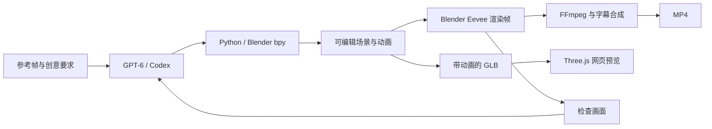

# 牛来，妈妈。GPT‑6 × Blender

[English](README.md)

**把《牛来》的“妈妈！牛来！”做成真正可编辑、可转动镜头的 3D 场景。** 小牛大喊，牛妈妈回头回应，镜头再拉远绕行，露出同一场景里的两头牛和蛇。

GPT‑6 / Codex 编写并修改 Blender Python 脚本，Blender 负责生成几何体和渲染动画。仓库包含完整代码、可编辑模型、网页预览和成片。


[Blender 源文件](output/niulai.blend) · [带动画的 GLB](web/assets/niulai.glb) · [GitHub Pages 部署](deploy/README.md)

## 本地预览

网站是纯静态页面，模型、音轨和前端库都在 `web/` 中，不调用 AI API。开发机使用 **Node.js 22+** 启动本地预览；访问者只需支持 WebGL 的浏览器，线上无需运行后端服务。

```sh
git clone git@github.com:askuy/niulai.git
cd niulai
npm ci
npm run dev
```

默认打开 **http://127.0.0.1:8080/**；端口占用时以终端输出的地址为准。也可以运行 `npm run dev -- -p 8767` 指定端口。

- 点击开始按钮，播放原片对白。
- 拖动旋转镜头，滚轮或双指缩放。
- 拖动进度条、重播“妈妈”，或切回导演视角。
- 网页界面采用简体中文，对白配有英文字幕。

## GitHub Pages

仓库自带 GitHub Actions 发布工作流。管理员在 **Settings → Pages → Source** 选择 **GitHub Actions** 后，向 `main` 推送网页修改即可自动发布。

部署成功后的地址为 **https://askuy.github.io/niulai/**。工作流直接发布 `web/`，包含 3D 网页和对白音轨，不发布 MP4，无需 Go 或其他后端运行环境。

发布设置和远程验证见 [部署说明](deploy/README.md)。下文的 Python / Blender 工具仅用于离线重新制作模型和视频。

## GPT‑6 在 3D 工作流中的优势

这个项目展示的是：**从参考画面和创意要求出发，规划场景、编写建模与动画代码，再根据渲染结果修改。**

| 优势 | 本项目里的具体表现 |
| --- | --- |
| **把视觉参考拆成可制作的结构** | 把牛角、耳朵、眼睛、眉毛、口鼻、嘴唇、牙齿和舌头拆成独立部件，再组织成角色。对应 `cow()`、`mouth_mesh()`。 |
| **安排几何体和空间关系** | 两种体型的牛、蛇、石头、灯光和相机共存于一个场景，换到侧面和背面仍然有实际几何结构。 |
| **协调多种动画** | 嘴部形态键、下颌运动、转头和相机运动使用统一时间轴。嘴部开合由 Python 提取的音量包络驱动，属于基于振幅的动画，并未做音素识别。 |
| **根据结果迭代修正** | 通过渲染检查修复了牛角接缝、嘴部与脸的连接、石头与牛蹄相交，以及镜头返回路径等问题。 |
| **交付可继续修改的工程** | 同时输出生成脚本、`.blend`、带动画的 `.glb`、MP4 和网页预览。比例、灯光、时间和镜头都可以调整后重新生成。 |

这里的实用价值是 **场景规划、代码生成和视觉反馈能在同一个工作流中衔接**。GPT‑6 编写构建场景的代码并进行修改，Blender 提供几何操作和渲染能力；绕行镜头让最终模型的空间结构可以被检查。

本项目经过多轮调整，没有进行受控的模型对比，也没有证据说明这些能力为 GPT‑6 独有。精确 API 模型快照未单独记录，不宣称“一次生成”、特定速度或领先其他模型的分数。

## Blender 与 Three.js 分别做什么



**Blender 完成建模、动画生成和视频渲染，Three.js 用来预览导出的 GLB。** 运行这些脚本不需要 Blender MCP 服务或 3D 生成 API。

工作流参考了用户提供的 [OpenAI 开发者社区讨论](https://community.openai.com/t/1395391/2)。其中社区成员描述了通过 `bpy` 驱动无界面 Blender 的做法；它是社区经验，不能据此认定官方发布演示的具体实现。

## 重新生成模型与视频

需要：

- **Blender 4.5 LTS**，以及 Eevee 支持的显卡与驱动。本项目原始版本使用 Blender 4.5.13。
- **Python 3.10+**、**Node.js 22+**、支持 H.264/AAC 编码的 **FFmpeg**。
- 中文字体，用于重新生成字幕，例如 macOS 的苹方或 Linux 的 Noto Sans CJK。

安装开发依赖，并生成模型与三张检查用静帧：

```sh
npm ci
npm run scene -- --preview
```

启动器会查找 `PATH` 中的 `blender` 或 macOS 标准安装位置。其他安装路径通过环境变量指定：

```sh
BLENDER_BIN=/path/to/blender npm run scene -- --preview
```

渲染 336 帧，再合成两种视频：

```sh
npm run render
npm run video
```

也可以直接运行：

```sh
blender --background --python src/build_scene.py -- --render
python3 src/compose_video.py
```

时间轴固定为 **24 fps**。动画长 14 秒，分辨率为 1080 × 1080；社交视频加入 3 秒原片对照，总长 17 秒。中间渲染帧放在 `renders/`，不提交到 Git。

音轨节选和音量包络已经包含在仓库中；需要从参考视频重新提取时运行 `npm run reference`。

## 验证网页

```sh
npm ci
npx playwright install chromium
npm test
```

检查程序会在空闲端口启动自己的本地服务器，结束后关闭。覆盖模型加载、音频播放与暂停、进度拖动、字幕、实际镜头旋转、重播和手机布局。

已有浏览器可通过 `CHROME_BIN=/path/to/chrome npm test` 使用。检查程序会启动临时静态服务器，也可通过 `PREVIEW_URL=https://askuy.github.io/niulai/ npm test` 验证线上网页。截图写入 `renders/`，报告写入 `output/verification.json`。

## 文件位置

| 路径 | 内容 |
| --- | --- |
| `.github/workflows/pages.yml` | GitHub Pages 自动发布工作流 |
| `deploy/` | 静态网站发布与验证说明 |
| `src/build_scene.py` | 几何体、材质、角色形态键与动画 |
| `src/prepare_reference.py` | 原声提取、音量包络计算 |
| `src/compose_video.py` | 原片对照、音轨与字幕合成 |
| `src/caption_frames.mjs` | 使用 Sharp 生成透明字幕图层 |
| `src/verify.mjs` | 浏览器交互验证 |
| `web/` | 网页、Three.js 库、音轨和动画 GLB |
| `output/` | 成片、Blender 源文件、封面和分镜图 |
| `reference/` | 原片节选和参考帧 |

## 来源

原梗和对白来自电影 **《牛来》**，参考素材是 **猫眼侃世界** 发布的[第三方银幕转拍片段](https://newsa.html5.qq.com/v1/share-video?vid=93819400611114414)。“牛来”是角色名。

对白使用原片音轨节选与重播，没有进行声音克隆。角色根据参考帧以程序化黏土卡通风格制作，未使用电影原始模型文件。原片、对白和原角色的权利归相应权利人。具体剪辑时间和第三方软件出处见 [ASSET_CREDITS.md](ASSET_CREDITS.md)。
