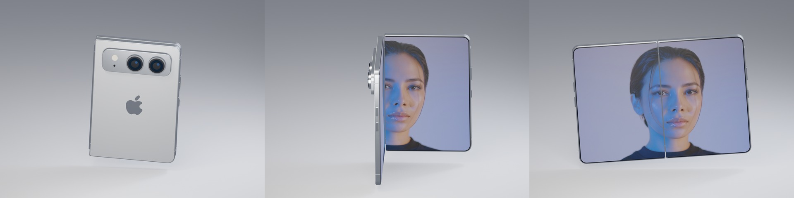
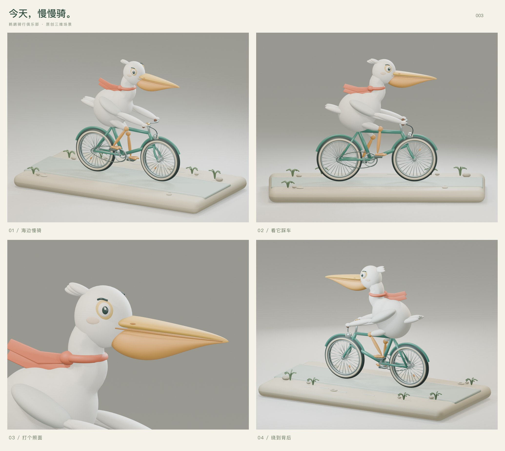
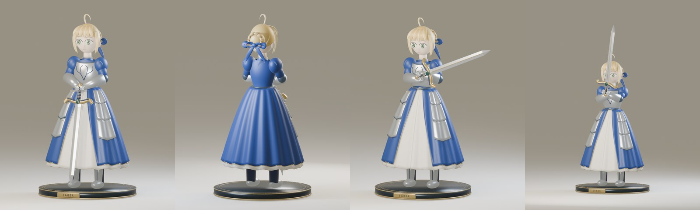
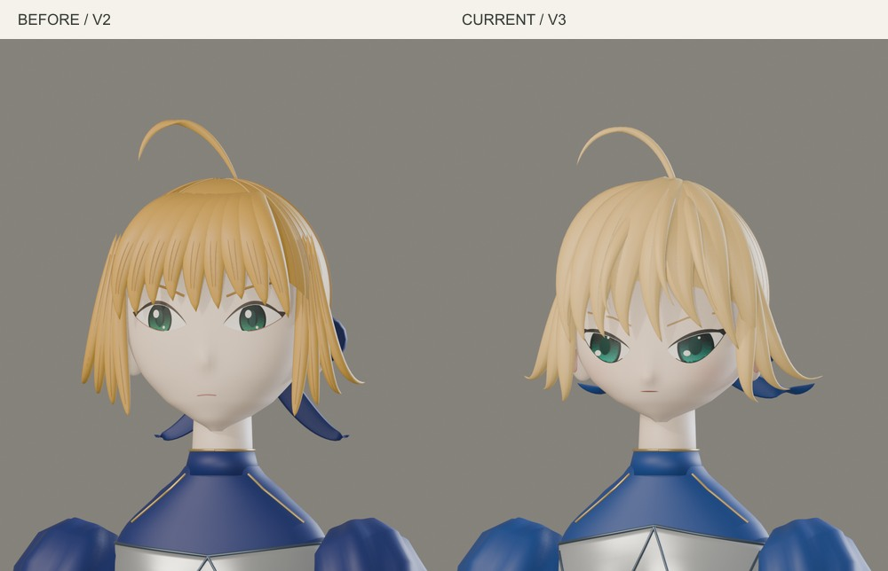
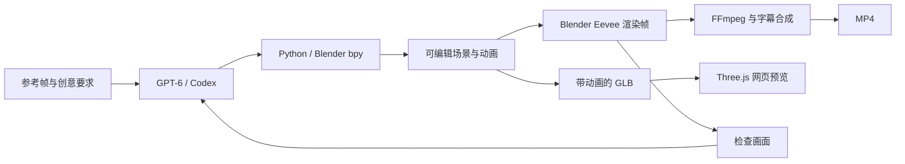

# gpt-blender

[English](README.md)

使用 GPT 与 Blender 制作的可编辑 3D 场景和交互式网页作品集，依次展示 Apple Duo、鹈鹕骑行、Saber 数字手办和牛来。

## Apple Duo · 展开，心动

银色折叠手机从合起到展开，内屏逐渐露出一张完整人像。双侧铰链、金属边框、后摄镜头、外屏和按钮均由 Blender 建模，浏览器播放导出的真实对象动画。外观是概念设计，未依据官方尺寸复刻。



```sh
npm run dev                       # 打开 http://127.0.0.1:8080/duo/
npm run duo:scene -- --preview     # 重建 Blender、GLB 和三张渲染检查图
npm run test:duo                   # 验证铰链、开合循环、交互及手机布局
npm run duo:video                  # 导出 12 秒、1080×1080 的 MP4
```

支持自动循环、0–180° 手动开合、拖动旋转、正背面视角和保存 PNG。设置「减少动态效果」时默认保持展开。人像来自 Unsplash，已保存在项目内并打包进模型，加载完成后交互不需要外部网络。

[Blender 工程](output/duo/duo.blend) · [动画 GLB](web/duo/assets/duo.glb) · [12 秒演示视频](output/duo/duo-reveal.mp4) · [建模脚本](src/build_duo.py)。工程时间轴是 30 fps 的 1–121 帧，记录合起到展开；网页将其编排为 12 秒往返循环。视频由浏览器渲染同一 GLB，再通过 FFmpeg 编码；外屏时钟界面由网页绘制。

## 鹈鹕骑行俱乐部

**今天，慢慢骑。** 一只系着珊瑚色围巾的奶白鹈鹕，骑薄荷绿自行车，在海边小景里兜风。长嘴、喉囊、羽毛、脚蹼、辐条、挡泥板、链条和车铃均为真实几何体。



沿用 **Blender Python 建模与动画 → Eevee 渲染检查 → GLB → Three.js** 流程。四秒循环中，双腿通过解析式双段求解跟随踏板，脚蹼与踏板保持水平，车轮以曲柄两倍的角速度转动。头部轻轻摇动，围巾随风摆动；网页路面标线按轮胎滚动速度后退。

```sh
npm run dev                          # 打开 http://127.0.0.1:8080/pelican/
npm run pelican:scene -- --preview   # 重建 Blender 工程、GLB 与四张检查图
npm run test:pelican                 # 验证整圈踩踏、动画和网页交互
```

可拖动旋转、滚轮缩放、切换三个镜头、调整 0.5–2 倍速、暂停、自动环绕、打铃和保存 PNG。空格暂停，B 键打铃；设置「减少动态效果」时默认静止。首次加载之后交互不再请求网络，车铃由浏览器本地合成。

构建脚本：[src/build_pelican.py](src/build_pelican.py)；可编辑工程：[output/pelican/pelican.blend](output/pelican/pelican.blend)；动画模型：[web/pelican/assets/pelican.glb](web/pelican/assets/pelican.glb)；网页：[web/pelican/](web/pelican/)。这是原创程序化场景，没有使用外部模型、图片纹理或音频。GLB 使用烘焙的对象变换动画，源工程保留独立部件，导出时按材质和父级合并静态网格。

检查程序使用与其他 Demo 相同的 `CHROME_BIN` 和 `PREVIEW_URL` 环境变量，覆盖脚与踏板在整圈中的接触、2:1 齿比、暂停冻结路面与围巾、真实调速、镜头与缩放、车铃、PNG、手机与平板布局、资源失败提示和减少动态效果。报告在 `output/pelican/verification.json`，截图在 `renders/pelican/`。

## Saber 数字手办

**[打开 Saber 展柜](https://askuy.github.io/gpt-blender-site/saber/)**。以《Fate/stay night》的 Saber 为灵感，制作了可从正面、侧面、背面观看的风格化三维手办：金色发束与编发、蓝裙、银色盔甲、Excalibur 和展示底座都有实际几何体。



第三版继续对照 [Good Smile「Saber ～誓约胜利之剑～」商品图](https://www.goodsmile.info/en/product/2780/)，重点修正角色辨识度：缩短下半张脸、重新绘制大虹膜的青绿色眼睛与眼尾、重做从偏心发缝扫下的分层刘海，并修正发梢厚边和侧发接头。面部加入轻微彩绘肤色，服装调整了胸甲上沿、裙摆起伏和双脚站位。挥剑时嘴部会切换战斗表情，收剑后恢复。面部与发型在 [src/saber_portrait.py](src/saber_portrait.py)，服装和剑在 [src/saber_sculpt.py](src/saber_sculpt.py)。



参考照片只用于观察，没有作为纹理或网页资源发布。相似度检查采用参考图与渲染的并排裁切，逐项比较脸部比例、眼睛和发束走向；照片的姿态、表情和灯光不同，因此不把像素误差换算成角色相似度百分比。保留本地参考照片和修改前截图时，运行 `node src/compare_saber.mjs` 可生成 `.cache/saber-reference/likeness-comparison.jpg`。这仍是程序化同人雕塑，发束层次、表情塑造和动态体态与参考成品存在差距。

- 默认有轻微呼吸、转头、眨眼和裙摆摆动。
- 点击「抬剑致意」或「唤醒圣剑」，播放举剑、蓄力、挥剑和收剑动作；双手通过双骨骼 IK 跟随剑柄，烘焙后导出。
- 可以自由旋转、拉近细节、切换三种灯光、查看白模，或暂停并保存 PNG 截图。暂停也会冻结光效。

沿用本项目的 **GPT‑6 / Codex 编写 Blender Python → Eevee 渲染检查 → 修改模型与动作 → 导出带骨骼和形态键的 GLB → Three.js 展示** 流程。网页中的金色粒子、灯光和相机交互由 Three.js 负责；角色几何与动作来自 Blender。它是程序化风格的同人练习，未使用官方模型或动作捕捉。

```sh
npm run dev                          # 打开 /saber/
npm run saber:scene -- --preview     # 离线重建工程、GLB 和八张检查图
npm run saber:scene -- --study face  # 只渲染面部草稿，不改工程或 GLB
npm run test:saber                   # 验证模型、骨骼、表情和网页交互
```

构建脚本：[src/build_saber.py](src/build_saber.py)；可编辑工程：[output/saber/saber.blend](output/saber/saber.blend)；网页模型：[web/saber/assets/saber.glb](web/saber/assets/saber.glb)。动作时间轴为 24 fps、384 帧：0–4 秒待机、4–10 秒致意、10–16 秒圣剑动作。完整工程保留独立部件，导出时才按材质合并网格；检查图保存在 `renders/saber/`。

模型约 **8.4 MB（未压缩文件大小）**，首次访问另需下载 Three.js 和页面文件。资源加载完成后，播放动作、换灯光和旋转镜头不产生新的网络请求。网站继续使用免费 GitHub Pages，没有 Python / Go 后端或 AI API 调用；Python 只在离线 Blender 构建时使用。用户设置「减少动态效果」时，首次打开会保持静止。

## 牛来，妈妈。

**把《牛来》的“妈妈！牛来！”做成真正可编辑、可转动镜头的 3D 场景。** 小牛大喊，牛妈妈回头回应，镜头再拉远绕行，露出同一场景里的两头牛和蛇。

GPT‑6 / Codex 编写并修改 Blender Python 脚本，Blender 负责生成几何体和渲染动画。仓库包含完整代码、可编辑模型、网页预览和成片。


[Blender 源文件](output/niulai.blend) · [带动画的 GLB](web/assets/niulai.glb) · [GitHub Pages 部署](deploy/README.md)

## 本地预览

网站是纯静态页面，模型、音轨和前端库都在 `web/` 中，不调用 AI API。开发机使用 **Node.js 22+** 启动本地预览；访问者只需支持 WebGL 的浏览器，线上无需运行后端服务。

```sh
git clone git@github.com:askuy/niulai.git gpt-blender
cd gpt-blender
npm ci
npm run dev
```

默认打开 **http://127.0.0.1:8080/**；端口占用时以终端输出的地址为准。也可以运行 `npm run dev -- -p 8767` 指定端口。

- 点击开始按钮，播放原片对白。
- 拖动旋转镜头，滚轮或双指缩放。
- 拖动进度条、重播“妈妈”，或切回导演视角。
- 网页界面采用简体中文，对白配有英文字幕。

## GitHub Pages

网站发布在 **https://askuy.github.io/gpt-blender-site/**。开发仓库保持私有，公开的 `askuy/gpt-blender-site` 只保存 `web/` 中的网页、模型和音轨，通过免费 GitHub Pages 托管。

运行 `npm run publish:pages` 可更新网站，需要 Git 的 SSH 推送权限。下文的 Python / Blender 工具仅用于离线重新制作模型和视频；发布过程无需后端运行环境。详情见 [部署说明](deploy/README.md)。

## GPT‑6 在 3D 工作流中的优势

这个项目展示的是：**从参考画面和创意要求出发，规划场景、编写建模与动画代码，再根据渲染结果修改。**

| 优势 | 本项目里的具体表现 |
| --- | --- |
| **把视觉参考拆成可制作的结构** | 把牛角、耳朵、眼睛、眉毛、口鼻、嘴唇、牙齿和舌头拆成独立部件，再组织成角色。对应 `cow()`、`mouth_mesh()`。 |
| **安排几何体和空间关系** | 两种体型的牛、蛇、石头、灯光和相机共存于一个场景，换到侧面和背面仍然有实际几何结构。 |
| **协调多种动画** | 嘴部形态键、下颌运动、转头和相机运动使用统一时间轴。嘴部开合由 Python 提取的音量包络驱动，属于基于振幅的动画，并未做音素识别。 |
| **根据结果迭代修正** | 通过渲染检查修复了牛角接缝、嘴部与脸的连接、石头与牛蹄相交，以及镜头返回路径等问题。 |
| **交付可继续修改的工程** | 同时输出生成脚本、`.blend`、带动画的 `.glb`、MP4 和网页预览。比例、灯光、时间和镜头都可以调整后重新生成。 |

这里的实用价值是 **场景规划、代码生成和视觉反馈能在同一个工作流中衔接**。GPT‑6 编写构建场景的代码并进行修改，Blender 提供几何操作和渲染能力；绕行镜头让最终模型的空间结构可以被检查。

本项目经过多轮调整，没有进行受控的模型对比，也没有证据说明这些能力为 GPT‑6 独有。精确 API 模型快照未单独记录，不宣称“一次生成”、特定速度或领先其他模型的分数。

## Blender 与 Three.js 分别做什么



**Blender 完成建模、动画生成和视频渲染，Three.js 用来预览导出的 GLB。** 运行这些脚本不需要 Blender MCP 服务或 3D 生成 API。

工作流参考了用户提供的 [OpenAI 开发者社区讨论](https://community.openai.com/t/1395391/2)。其中社区成员描述了通过 `bpy` 驱动无界面 Blender 的做法；它是社区经验，不能据此认定官方发布演示的具体实现。

## 重新生成模型与视频

需要：

- **Blender 4.5 LTS**，以及 Eevee 支持的显卡与驱动。本项目原始版本使用 Blender 4.5.13。
- **Python 3.10+**、**Node.js 22+**、支持 H.264/AAC 编码的 **FFmpeg**。
- 中文字体，用于重新生成字幕，例如 macOS 的苹方或 Linux 的 Noto Sans CJK。

安装开发依赖，并生成模型与三张检查用静帧：

```sh
npm ci
npm run scene -- --preview
```

启动器会查找 `PATH` 中的 `blender`、macOS 标准安装位置或 `~/.local/opt/blender-4.5.13/Blender.app`。其他安装路径通过环境变量指定：

```sh
BLENDER_BIN=/path/to/blender npm run scene -- --preview
```

渲染 336 帧，再合成两种视频：

```sh
npm run render
npm run video
```

也可以直接运行：

```sh
blender --background --python src/build_scene.py -- --render
python3 src/compose_video.py
```

时间轴固定为 **24 fps**。动画长 14 秒，分辨率为 1080 × 1080；社交视频加入 3 秒原片对照，总长 17 秒。中间渲染帧放在 `renders/`，不提交到 Git。

音轨节选和音量包络已经包含在仓库中；需要从参考视频重新提取时运行 `npm run reference`。

## 验证网页

```sh
npm ci
npx playwright install chromium
npm test
npm run test:saber
```

检查程序会在空闲端口启动自己的本地服务器，结束后关闭。覆盖模型加载、音频播放与暂停、进度拖动、字幕、实际镜头旋转、重播和手机布局。

已有浏览器可通过 `CHROME_BIN=/path/to/chrome npm test` 使用。检查程序会启动临时静态服务器，也可通过 `PREVIEW_URL=https://askuy.github.io/gpt-blender-site/ npm test` 验证线上网页。截图写入 `renders/`，报告写入 `output/verification.json`。

Saber 使用相同的环境变量，`PREVIEW_URL` 填站点根地址（程序会追加 `saber/`）。Saber 检查涵盖宝石导出尺寸、眨眼形态键、手部与剑的实际运动、暂停光效、动作结束回待机、镜头、灯光、白模、截图、手机布局和额外网络请求；报告写入 `output/saber/verification.json`。

## 文件位置

| 路径 | 内容 |
| --- | --- |
| `src/publish_pages.mjs` | 将网页资源发布到独立 Pages 仓库 |
| `deploy/` | 静态网站发布与验证说明 |
| `src/build_scene.py` | 几何体、材质、角色形态键与动画 |
| `src/build_saber.py` | Saber 手办、双手握剑 IK、骨骼动画与 GLB 导出 |
| `src/saber_sculpt.py` | 对照手办参考图重做的面部、发型、服装和剑 |
| `src/verify_saber.mjs` | Saber 网页与动画验证 |
| `web/saber/` | Saber 展柜及独立模型资源 |
| `src/prepare_reference.py` | 原声提取、音量包络计算 |
| `src/compose_video.py` | 原片对照、音轨与字幕合成 |
| `src/caption_frames.mjs` | 使用 Sharp 生成透明字幕图层 |
| `src/verify.mjs` | 浏览器交互验证 |
| `web/` | 网页、Three.js 库、音轨和动画 GLB |
| `output/` | 成片、Blender 源文件、封面和分镜图 |
| `reference/` | 原片节选和参考帧 |

## 来源

原梗和对白来自电影 **《牛来》**，参考素材是 **猫眼侃世界** 发布的[第三方银幕转拍片段](https://newsa.html5.qq.com/v1/share-video?vid=93819400611114414)。“牛来”是角色名。

对白使用原片音轨节选与重播，没有进行声音克隆。角色根据参考帧以程序化黏土卡通风格制作，未使用电影原始模型文件。原片、对白和原角色的权利归相应权利人。具体剪辑时间和第三方软件出处见 [ASSET_CREDITS.md](ASSET_CREDITS.md)。
